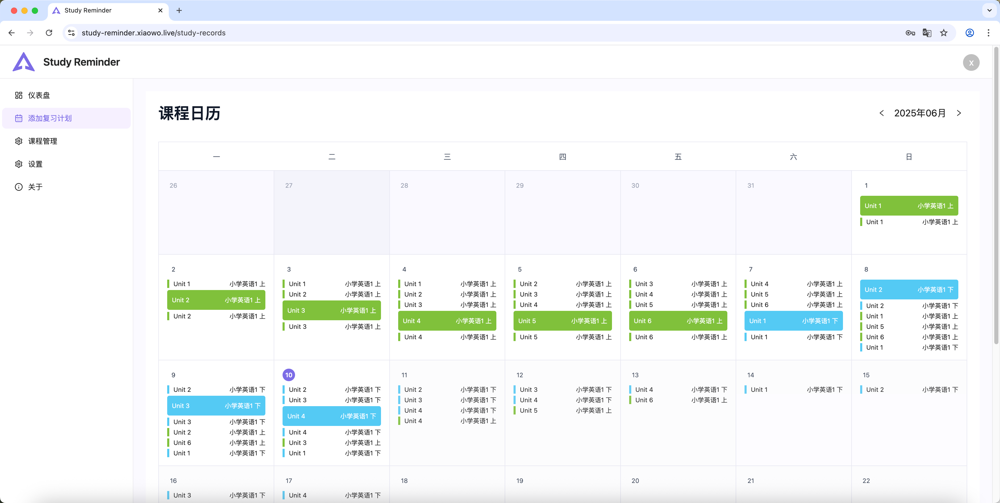

# Study Reminder

<div align="center">



</div>

## 📖 项目介绍

**Study Reminder** 是一款旨在帮助用户更有效记忆和巩固所学知识的智能学习工具。我们相信，遵循艾宾浩斯遗忘曲线进行及时复习是长期记忆的关键。本应用通过灵活的打卡记录和个性化的复习规则设置，帮助您系统地安排复习计划，确保每一个知识点都能得到充分回顾，从而深化理解，提升学习效率。

## ✨ 主要功能

- **课程管理**: 自由创建和组织您的学习课程。
- **学习打卡**: 记录每次学习的内容、时长和笔记，并以日历视图直观展示。
- **智能复习**: 自定义复习规则，应用将自动生成待办复习列表。
- **数据统计**: 跟踪连续打卡天数和学习趋势，激励学习动力。
- **通知系统**: 通过邮件和应用内实时通知，及时获得复习提醒。
- **安全认证**: 完善的用户注册、登录和密码管理体系。

## 🏗️ 技术栈

|              | 前端 (`app`)                                                                                             | 后端 (`interface`)                                                                                           |
| :----------- | :------------------------------------------------------------------------------------------------------- | :----------------------------------------------------------------------------------------------------------- |
| **框架**     | [React](https://react.dev/), [Vite](https://vitejs.dev/), [TanStack Router](https://tanstack.com/router) | [NestJS](https://nestjs.com/), [Prisma](https://www.prisma.io/), [PostgreSQL](https://www.postgresql.org/)   |
| **UI**       | [Ant Design](https://ant.design/), [UnoCSS](https://unocss.dev/)                                         | -                                                                                                            |
| **状态管理** | [Zustand](https://zustand-demo.pmnd.rs/)                                                                 | -                                                                                                            |
| **实时通信** | [Socket.io Client](https://socket.io/)                                                                   | [Socket.io](https://socket.io/), [BullMQ](https://bullmq.io/)                                                |
| **核心工具** | [TypeScript](https://www.typescriptlang.org/), [ahooks](https://ahooks.js.org/)                          | [TypeScript](https://www.typescriptlang.org/), [JWT](https://jwt.io/), [Nodemailer](https://nodemailer.com/) |

- **基础设施**: Docker, Docker Compose, Nginx, pnpm, GitHub Actions

## 📁 项目结构

本项目为一个 Monorepo 仓库，由 `pnpm` 管理，包含以下主要模块：

- `packages/app`: 前端应用，基于 React 和 Ant Design，提供用户交互界面。详情请见 [**前端文档**](./packages/app/README.md)。
- `packages/interface`: 后端 API 服务，基于 NestJS 和 Prisma，负责业务逻辑和数据处理。详情请见 [**后端文档**](./packages/interface/README.md)。

## 🚀 快速开始

### 环境要求

- Node.js 22+
- pnpm 8+
- Docker & Docker Compose
- PostgreSQL 15+

### 本地开发

1.  **克隆仓库**

    ```bash
    git clone https://github.com/English-Assistant/Study-Reminder.git
    cd Study-Reminder
    ```

2.  **配置环境变量**

    ```bash
    # 复制 .env.example 并重命名为 .env
    cp .env.example .env
    # 编辑 .env 文件，至少需要配置数据库连接 (DATABASE_URL)
    ```

3.  **安装依赖**

    ```bash
    pnpm install
    ```

4.  **运行数据库迁移** (首次运行或 schema 变更后)

    ```bash
    # 此命令会比较 Prisma schema 与数据库的差异，
    # 生成新的迁移文件并将其应用到数据库。
    pnpm --filter @y/interface exec prisma migrate dev
    ```

5.  **启动开发服务**

    ```bash
    # 在一个终端中启动前端开发服务器
    pnpm --filter @y/review dev

    # 在另一个终端中启动后端开发服务器
    pnpm --filter @y/interface dev
    ```

服务启动后访问：

- 前端应用：`http://localhost:5173`
- 后端 API：`http://localhost:3001`

## 🛠️ 部署指南

本项目支持使用 Docker Compose 进行一键部署，详情请参考部署文档。

1.  **编辑环境变量**
    ```bash
    cp docker/.env.example docker/.env
    # 根据需要修改配置
    ```
2.  **启动服务**
    ```bash
    # 该命令会自动构建或拉取镜像，运行数据库迁移，并启动所有服务
    docker-compose -f docker/docker-compose.yml --env-file docker/.env up -d
    ```

## 🤝 贡献指南

我们欢迎所有形式的贡献！您可以：

- [报告 Bug](https://github.com/English-Assistant/Study-Reminder/issues/new?template=bug_report.md)
- [提出功能建议](https://github.com/English-Assistant/Study-Reminder/issues/new?template=feature_request.md)

如果您想贡献代码，请 Fork 本项目并提交 Pull Request。我们遵循 [Conventional Commits](https://conventionalcommits.org/) 规范。

## 📜 许可证

本项目采用 [MIT 许可证](./LICENSE)。

---

<div align="center">
  <strong>如果这个项目对您有帮助，请给我们一个 ⭐！</strong>
  <br>
  Made with ❤️ by <a href="https://github.com/English-Assistant">English-Assistant</a>
</div>
